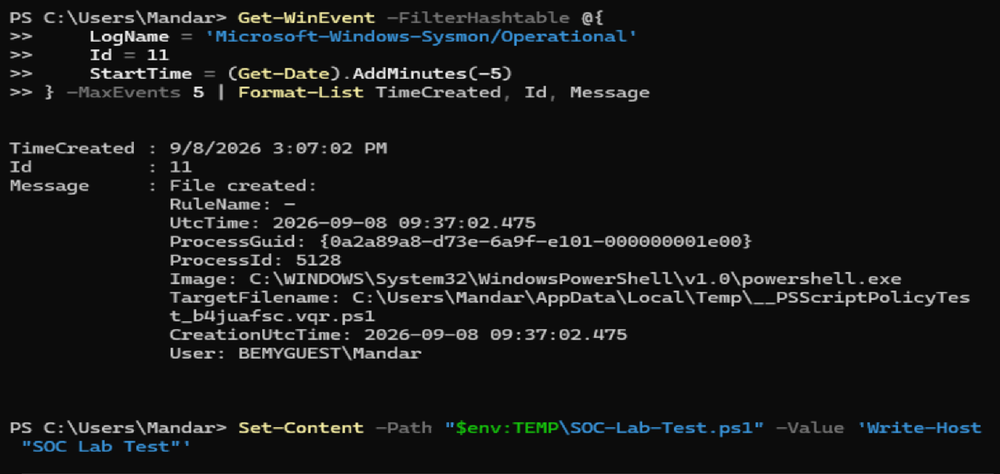
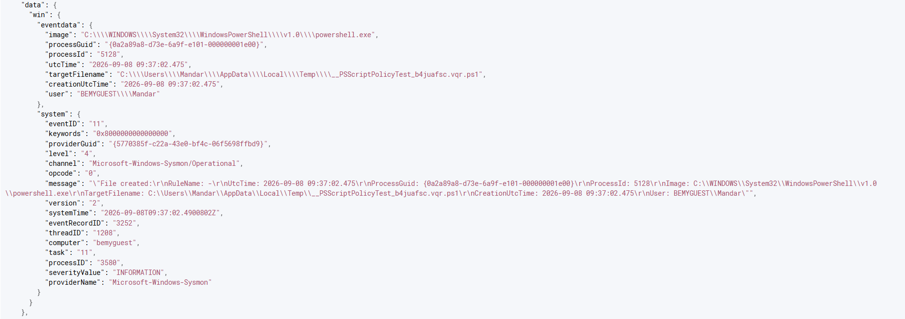
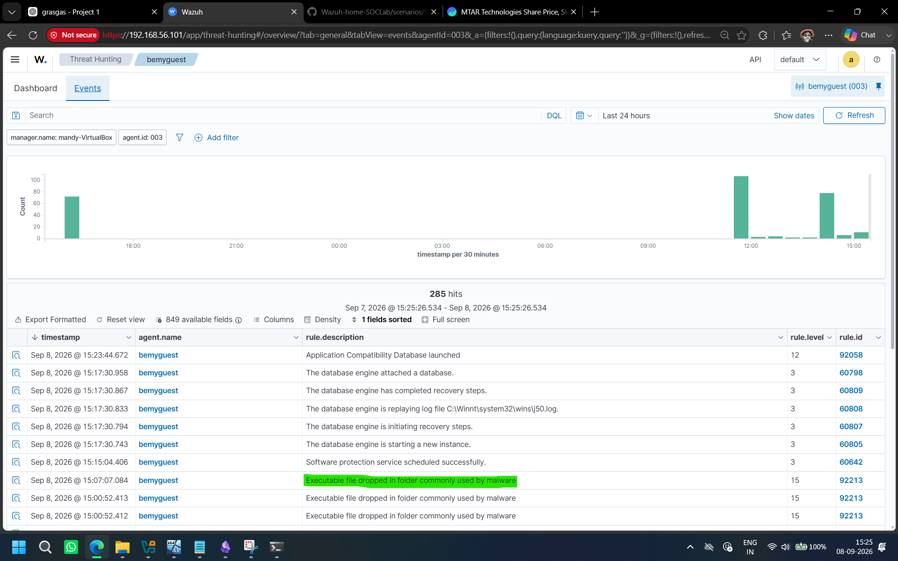

## 1. Objective

Detect the creation of a PowerShell script file in the Windows user's temporary directory using Sysmon telemetry and Wazuh.

This scenario demonstrates how endpoint telemetry generated by Sysmon can be collected by the Wazuh agent, analyzed by the Wazuh manager, and investigated through Wazuh alerts.

---

## 2. Scenario Description

PowerShell is commonly used by administrators for legitimate automation. However, attackers can also abuse PowerShell to create and execute scripts.

Temporary directories are noteworthy locations during investigations because scripts and other files may be created there during execution.

For this controlled lab scenario, a PowerShell script file was created inside the user's temporary directory.

---

## 3. Detection Flow

```
Windows Endpoint
       ↓
PowerShell creates .ps1 file
       ↓
Sysmon generates Event ID 11 (File Create)
       ↓
Wazuh Agent collects the event
       ↓
Wazuh Manager analyzes the event
       ↓
Wazuh detection rule generates an alert
       ↓
Alert stored in alerts.json
       ↓
Alert displayed in Wazuh Dashboard
```

---

## 4. Test Activity

A controlled PowerShell command was used to create a test script:

```
Set-Content -Path C:\Users\<USERNAME>\AppData\Local\Temp\SOC-Lab-Test.ps1 -Value "Write-Host SOC-Lab-Test"
```

The test file was created only for this lab scenario.

---

## 5. Telemetry Generated

Sysmon successfully recorded the activity.

### Sysmon Event ID

**Event ID: 11**

**Event Name: File Create**

Relevant telemetry included:

- Process Image: `powershell.exe`
- Target Filename: `SOC-Lab-Test.ps1`
- Location: User temporary directory
- User responsible for the activity
- Process ID
- Process GUID
- Creation timestamp

---

## 6. Wazuh Detection

The event was successfully received and processed by Wazuh.

The corresponding event was found in:

```
/var/ossec/logs/alerts/alerts.json
```

The alert showed that:

- The event originated from the Windows endpoint.
- Sysmon generated Event ID 11.
- PowerShell was responsible for creating the file.
- The target file was located in the user's temporary directory.

A Wazuh Sysmon detection rule generated the alert.

---

## 7. Investigation

During the investigation, the following fields were reviewed:

### Process Image

```
powershell.exe
```

This identified PowerShell as the process responsible for the activity.

### Target Filename

```
SOC-Lab-Test.ps1
```

This identified the file created during the controlled test.

### Event ID

```
11
```

Sysmon Event ID 11 confirms a file creation event.

### User

The event contained the Windows user account responsible for executing the PowerShell process.

### Timestamp

The event timestamp was used to correlate the PowerShell process activity with the file creation event.

---

## 8. Analyst Assessment

The activity was generated intentionally as part of a controlled SOC lab test.

Although PowerShell activity and script creation in temporary directories can be legitimate, similar behavior may require investigation in a real environment.

An analyst should verify:

- Whether the PowerShell execution was expected.
- Which user executed the process.
- The parent process that launched PowerShell.
- The command line used.
- The content of the created script.
- Whether the script was subsequently executed.
- Whether additional suspicious activity occurred around the same time.

---

## 9. Result

**Status: Successfully Detected**

The complete telemetry pipeline was successfully validated:

```
PowerShell
→ Sysmon Event ID 11
→ Wazuh Agent
→ Wazuh Manager
→ Detection Rule
→ alerts.json
→ Wazuh Dashboard
```

This confirmed that the SOC lab can detect and investigate PowerShell-related file creation activity on the monitored Windows endpoint.

---

## 10. MITRE ATT&CK Reference

**Technique: Command and Scripting Interpreter – PowerShell**

```
T1059.001
```

PowerShell can be used for legitimate administration but is also frequently abused by attackers for execution and automation.

---

## 11. Screenshots

Add the following screenshots:

1. **PowerShell command creating the test `.ps1` file** and **Sysmon Event Viewer showing Event ID 11**

   

2.  Wazuh `alerts.json` showing the detection
   


3. **Wazuh Dashboard showing the alert and event details**
   

---

## 12. Key Learning

This scenario demonstrated the importance of correlating endpoint telemetry across multiple stages.

A file creation event alone does not necessarily indicate malicious activity. Context is required to determine whether the activity is legitimate or suspicious.

The investigation process involved identifying:

- The process responsible.
- The file created.
- The location of the file.
- The user involved.
- The timestamp.
- Related process activity.

This is the same type of evidence-based investigation approach used by SOC analysts when reviewing endpoint alerts.