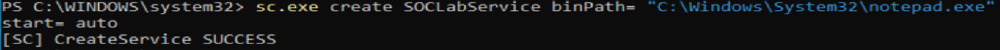
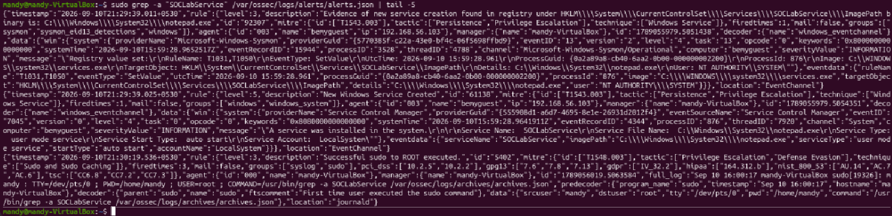
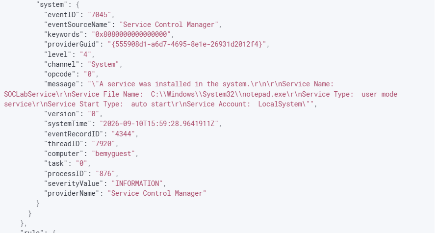

## 1. Objective

Detect the creation of a new Windows service on a monitored Windows endpoint.

The scenario simulates an attacker creating a Windows service configured for **automatic startup**, which can be abused for persistence and privilege escalation.

---

## 2. MITRE ATT&CK Mapping

- **Technique:** T1543.003 — Create or Modify System Process: Windows Service
- **Tactics:** Persistence, Privilege Escalation

---

## 3. Detection Strategy

The detection uses Windows event telemetry collected by the Wazuh agent.

The primary evidence is:

- **Windows Event ID 7045** — Service Control Manager reports that a service was installed.
- **Sysmon Event ID 13** — Registry modifications associated with the newly created service.

Wazuh's built-in rules detected the service creation, providing live alert evidence.

---

## 4. Custom Detection Rule

Custom Wazuh Rule `100104`:

```
<rule id="100104" level="10">
  <decoded_as>json</decoded_as>
  <field name="win.system.eventID">1</field>
  <field name="win.eventdata.image" type="pcre2">(?i)\\sc\.exe$</field>
  <field name="win.eventdata.commandLine" type="pcre2">(?i)\s(create|config)\s</field>

  <description>SOC Lab: Windows Service created or configured</description>

  <group>sysmon,persistence,service_creation,</group>

  <mitre>
    <id>T1543.003</id>
  </mitre>
</rule>
```

**Rule ID:** `100104`  
**Severity:** Level 10

The rule was successfully validated with `wazuh-logtest`.

---

## 5. Detection Logic

The custom rule checks for:

1. JSON-decoded Windows telemetry.
2. Sysmon **Event ID 1**.
3. `sc.exe` as the process image.
4. `create` or `config` in the command line.

When these conditions are satisfied, Rule `100104` generates an alert.

---

## 6. Attack Simulation

The following command was executed on the Windows 11 endpoint:

```
sc.exe create SOCLabService binPath= "C:\Windows\System32\notepad.exe" start= auto
```

The Windows endpoint returned:

```
[SC] CreateService SUCCESS
```

The service was therefore successfully created.

---

## 7. Telemetry Generated

The service creation generated multiple pieces of telemetry.

### Sysmon Event ID 13

Wazuh received registry changes associated with:

```
HKLM\System\CurrentControlSet\Services\SOCLabService\ImagePath
```

The configured binary was:

```
C:\Windows\System32\notepad.exe
```

The service was configured with:

```
Start: DWORD (0x00000002)
```

The registry activity was performed by:

```
NT AUTHORITY\SYSTEM
```

### Windows Event ID 7045

The Service Control Manager generated Event ID `7045`:

```
A service was installed in the system.
```

Service details included:

```
Service Name: SOCLabService
Service File Name: C:\Windows\System32\notepad.exe
Service Type: user mode service
Service Start Type: auto start
Service Account: LocalSystem
```

---

## 8. Wazuh Detection

Wazuh successfully detected the service creation with its built-in rules.

### Rule 92307

```
Evidence of new service creation found in registry
```

- **Level:** 3
- **MITRE:** T1543.003
- **Technique:** Windows Service

### Rule 61138

```
New Windows Service Created
```

- **Level:** 5
- **MITRE:** T1543.003
- **Technique:** Windows Service

Both alerts were generated for agent `003` (`bemyguest`).

---

## 9. Alert Verification

The alerts were successfully verified in:

```
/var/ossec/logs/alerts/alerts.json
```

The live Wazuh alerts confirmed:

```
Rule 92307 → Evidence of new service creation
Rule 61138 → New Windows Service Created
```

The alerts contained:

```
SOCLabService
```

and the service executable:

```
C:\Windows\System32\notepad.exe
```

This confirms that **live Wazuh detection was successful**.

---

## 10. Detection Flow

```
Windows 11 Endpoint
        │
        ▼
sc.exe create SOCLabService
        │
        ▼
Windows Service created
        │
        ├──────────────► Sysmon Event ID 13
        │                    │
        │                    ▼
        │                 Registry modification
        │
        └──────────────► Windows Event ID 7045
                             │
                             ▼
                       Wazuh Agent
                             │
                             ▼
                       Wazuh Manager
                             │
                             ▼
                       Wazuh Rules
                       ┌─────┴─────┐
                       ▼           ▼
                    Rule 92307  Rule 61138
                       │           │
                       └─────┬─────┘
                             ▼
                         Alert
```

---

## 11. Screenshots

### Screenshot 1 — Service Creation





### Screenshot 2 — Proof from wazuh manager




### Screenshot 3 — Wazuh Alert Details



---

## 12. Conclusion

Scenario 8 successfully demonstrated **Windows Service Creation detection** using Wazuh.

The custom Rule `100104` was successfully validated using `wazuh-logtest`, while the actual service creation generated multiple Windows security telemetry events.

Most importantly, Wazuh **successfully generated live alerts** for the real activity through Rules `92307` and `61138`, both mapped to **MITRE ATT&CK T1543.003 — Windows Service**.

This scenario demonstrates how a SOC analyst can correlate Windows service installation activity with persistence and privilege-escalation behavior.